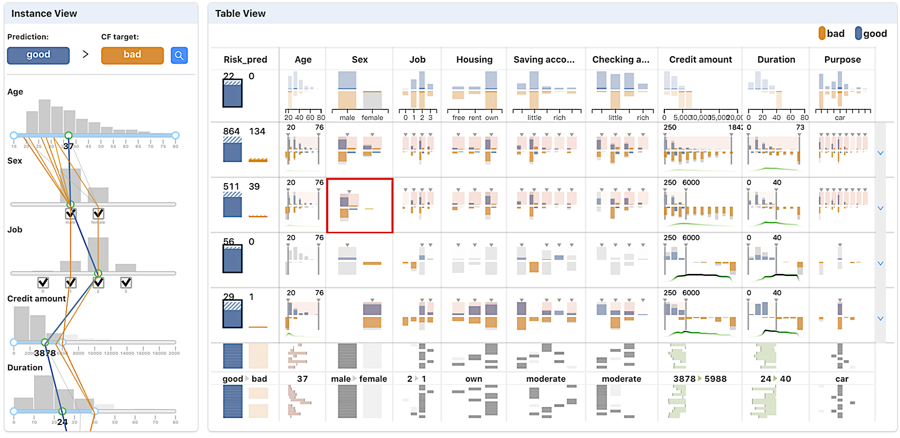

# DECE: decision explorer with counterfactual explanations for machine learning models



This repository contains code and notebooks for the paper "*DECE: decision explorer with counterfactual explanations for machine learning models*." Check the [paper](https://ieeexplore.ieee.org/document/9229232). 

---
# Introduction

Counterfactual explanations allow humans to understand a model prediction by answering the question: How does one obtain an alternative or desirable prediction by altering the data just slightly? For instance, a counterfactual explanation is like "*if you had an income of $40,000 rather than $30,000, your loan request would have been approved.*"

DECE is a visualization system that helps model developers and model users explore and understand machine learning models' decisions through counterfactual explanations. DECE supports exploring counterfactual explanations for a single instance and also data subgroups. In the subgroup-level analysis, it can be used to find the answer for the questions like "*Does a low glucose level assure that the patients will be predicted healthy (or at low-risk for diabetes) by the model? What are other factors for diabetes?*" 

This repository contains:
* DECE-engine, an efficient and scalable implementation of the counterfactual explanation generation algorithm presented in the paper. Check the [tutorial notebooks](./tutorials) for the usage.
* DECE-visualization, a browser-based interactive visualization system. 

---

# Installation

## Development
**STEP-0: Clone the repository the original source or your forks.**

    git clone https://github.com/ChengFR/DECE-research.git

**STEP-1: Prepare for the environment.**

Prepare for the [python](https://www.python.org/) enviroment (python3.7 is recommended):

    virtualenv venv/
    source venv/bin/activate
    pip install -r requirements.txt

Prepare for the [node.js](https://nodejs.org/) enviroment (for browser-based visualization):

    cd client/
    npm install

**STEP-2: Add the current path to PYTHONPATH.**

    export PYTHONPATH=`pwd`:$PYTHONPATH

# Usage

## DECE-engine: Generate counterfactual explanations 

Please check the [tutorial notebooks](./tutorials).

## DECE-visualization

DECE is web application built on [flask (python)](https://flask.palletsprojects.com/en/1.1.x/) and [node.js](https://nodejs.org/). To run the visualization part of the system, you ought to run a flask server and a web server. Please follow the guidance below.

**STEP-1: Start flask development server:**
```bash
python -m server.cli
```

**STEP-2: Start client development server:**
```
cd client/
npm start
```

**STEP-3: Visit `localhost:3000/` for the visualization.**

# Cite this work
    @ARTICLE{9229232,
      author={Cheng, Furui and Ming, Yao and Qu, Huamin},
      journal={IEEE Transactions on Visualization and Computer Graphics}, 
      title={DECE: Decision Explorer with Counterfactual Explanations for Machine Learning Models}, 
      year={2021},
      volume={27},
      number={2},
      pages={1438-1447},
      doi={10.1109/TVCG.2020.3030342}}
